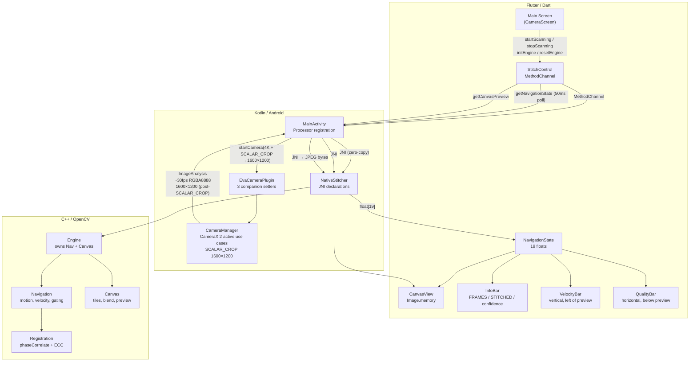
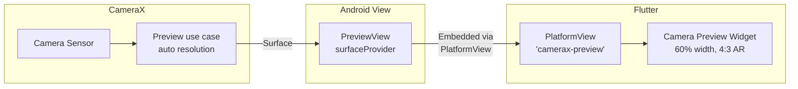
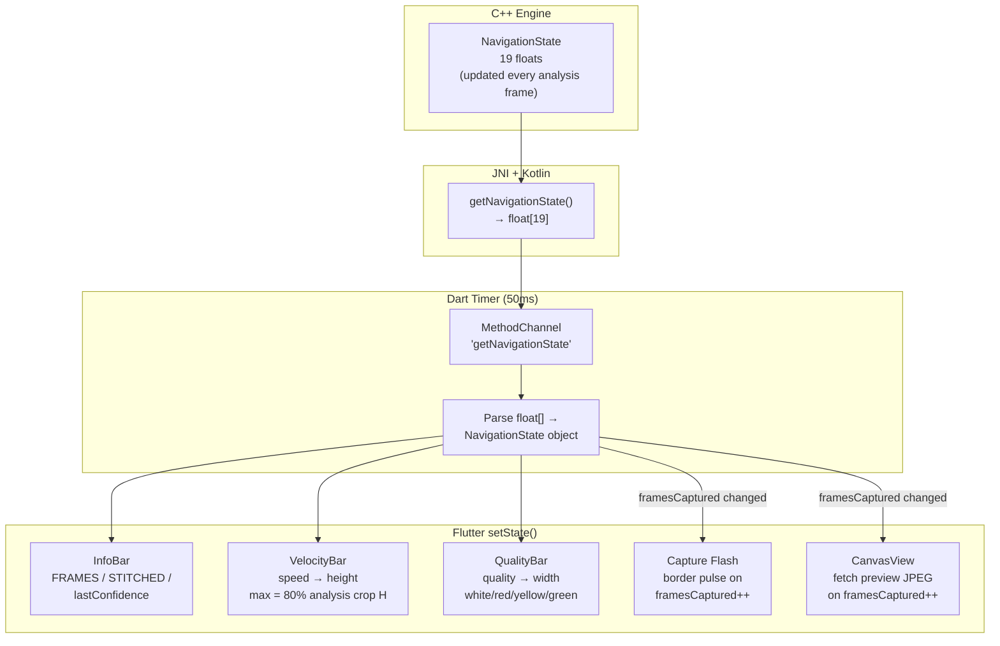
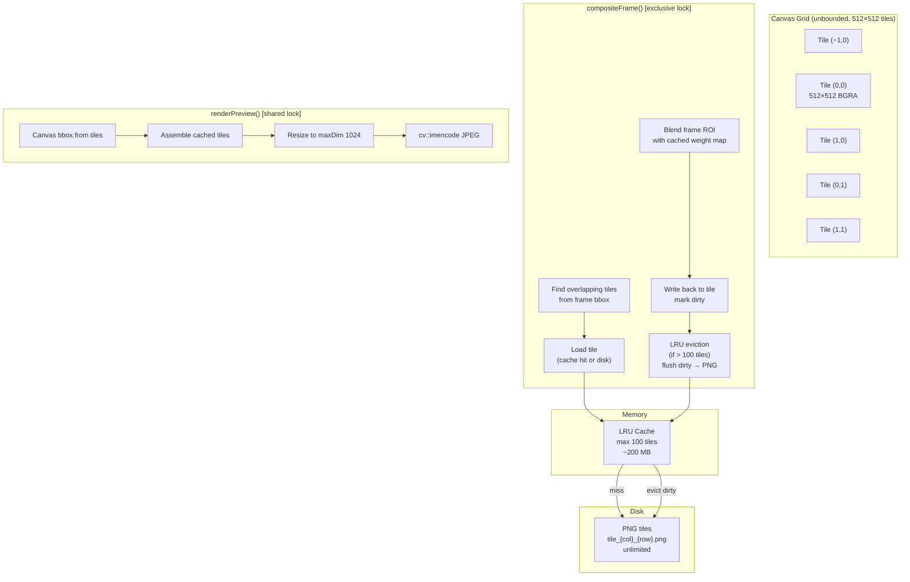
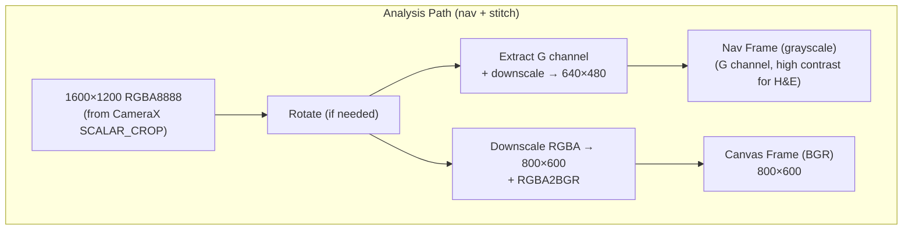
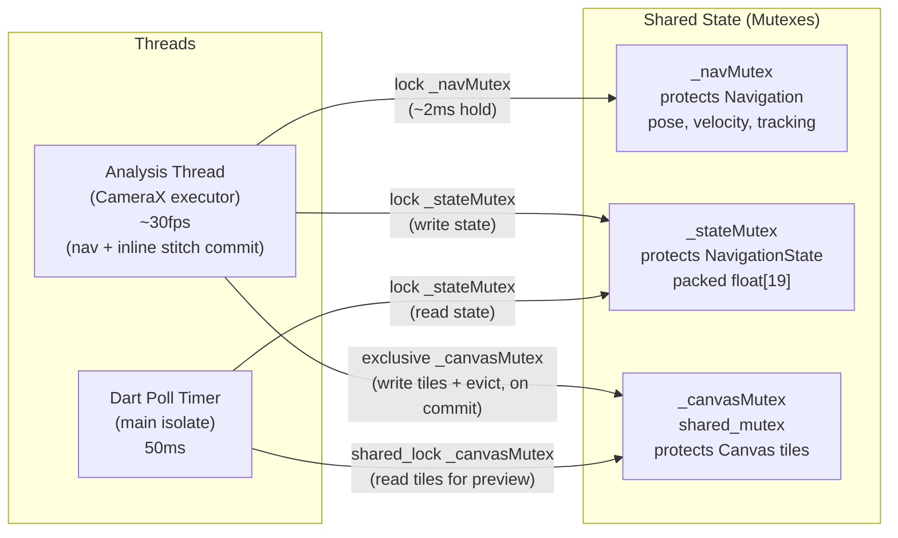

# Architecture Reference — Stitching Pipeline v3

**Date**: 2025-07-10
**State**: Target architecture after MVP v3 is complete

---

## 1. System Overview

Three-layer architecture: Flutter UI → Kotlin Camera (CameraX plugin) → C++ Stitching (OpenCV).



---

## 2. Component Boundaries

### Flutter Layer (`lib/`)

- **Owns**: UI state, user interaction, display
- **Does NOT own**: Frame processing, stitching logic, pose computation
- **Communication**: MethodChannel (commands + polling), EventChannel (camera FPS/frame count)

### Kotlin Layer (`android/app/`, `packages/eva_camera/`)

- **Owns**: Camera lifecycle (CameraX), frame delivery, capture triggers
- **Does NOT own**: Frame processing logic (passes through to C++)
- **Communication**: JNI calls to C++ (passes ByteBuffer pointers), MethodChannel to Dart

### C++ Layer (`native/stitcher/`)

- **Owns**: All frame processing, motion estimation, registration, compositing, tile management
- **Does NOT own**: Camera control, UI rendering
- **Communication**: JNI entry points (receives ByteBuffers, returns float arrays and JPEG bytes)

### Key Contract: ImageProxy Lifetime

- `ImageProxy` is valid only during the callback.
- CameraManager closes it in a `finally` block after processor returns.
- ByteBuffer pointers from `GetDirectBufferAddress()` are invalid after `imageProxy.close()`.
- All native processing must complete before returning from the JNI callback.

---

## 3. Preview Pipeline

The preview pipeline is entirely managed by CameraX. It provides a live camera feed to the user.



**Key properties**:

- Resolution: CameraX auto-negotiated (device-dependent)
- Format: Native surface (not YUV)
- Rotation: `ROTATION_0` — CameraX handles display rotation internally for Preview
- No processing applied
- Always running when camera is started
- 4:3 aspect ratio enforced by Flutter `AspectRatio` widget

---

## 4. Analysis / Navigation Pipeline

The analysis pipeline processes every ImageAnalysis frame (~30fps) for motion tracking, velocity estimation, and capture gating.

```mermaid
flowchart LR
    subgraph "CameraX"
        IA["ImageAnalysis<br/>1600×1200 RGBA8888<br/>(post-SCALAR_CROP)"]
    end

    subgraph "Kotlin"
        FP["FrameProcessor<br/>imageProxy.planes[0].buffer"]
    end

    subgraph "JNI Bridge"
        GDA["GetDirectBufferAddress<br/>zero-copy RGBA pointer"]
    end

    subgraph "Engine.processAnalysisFrame"
        ROT_A["applyRotation()<br/>(if needed)"]
        EXTRACT_G["extractGreenDownscale()<br/>G channel of 1600×1200<br/>→ 640×480 grayscale"]
        LOG_A["Log: frame dims<br/>(first frame only)"]
    end

    subgraph "Navigation.processFrame"
        PC["cv::phaseCorrelate()<br/>vs previous nav frame<br/>→ (dx, dy, confidence)"]
        SCALE["dx × navScale<br/>→ canvas pixel displacement"]
        POSE["pose += displacement<br/>(canvas coords)"]
        VEL["velocity EMA<br/>speed + deadband"]
        SHARP["Laplacian variance<br/>→ sharpness [0–1]"]
        TRACK["Tracking FSM<br/>INIT→TRACKING→LOST"]
        GATE["Capture gating<br/>velocity + sharpness +<br/>distance + cooldown +<br/>overlap"]
        QUAL["quality = ∛(conf × sharp × overlap)<br/>= 0 if overlap = 0"]
    end

    subgraph "Return"
        RET["Return void<br/>(commit done inline if gating passed)"]
    end

    IA --> FP --> GDA --> ROT_A --> EXTRACT_G --> LOG_A
    LOG_A --> PC --> SCALE --> POSE --> VEL --> SHARP --> TRACK --> GATE --> QUAL --> RET
```



**Key invariants**:

- G channel extracted from RGBA (high contrast for H&E stained slides)
- Nav frame: 1600×1200 RGBA → extract G → downscale to 640×480 grayscale
- Phase correlation displacement is in nav-frame pixels
- Multiply by `navScale = CANVAS_FRAME_W / NAV_FRAME_W = 800/640 = 1.25` → canvas pixel displacement
- Pose accumulates in canvas coordinates (origin = first committed frame)
- Quality formula: $quality = \sqrt[3]{lastConfidence \times sharpness \times overlapRatio}$, forced to 0 when overlap = 0
- Gating logs: every decision logged with reason code + all metrics
- **Stitch commit**: When gating passes, stitch commit (RGBA downscale → 800×600 BGR → ECC → composite) happens inline within `processAnalysisFrame`. Returns `void` to Kotlin.

---

## 5. Stitch Commit Pipeline *(Inline in processAnalysisFrame)*

The stitch commit fires when navigation gating passes. It happens **inline within `processAnalysisFrame`** using the same analysis frame — no separate ImageCapture use case, no Kotlin-side callback.

### Signal Path

```
C++ gate fires → returns bool → JNI jboolean → NativeStitcher.Boolean
→ FrameProcessor returns 1.0f → CameraManager triggers captureStitchFrame()
→ StitchFrameProcessor.onStitchFrame() → NativeStitcher.processStitchFrame()
→ Engine::processStitchFrame() — downscale 4K RGBA → composite at _pendingCapturePose
```



```mermaid
flowchart LR
    subgraph "Analysis Frame (same frame as nav)"
        AF["ImageAnalysis RGBA8888<br/>1600×1200"]
        BUFS_A["Single RGBA ByteBuffer<br/>passed from Kotlin"]
    end

    subgraph "Engine.processAnalysisFrame (commit path)"
        GDB_A["GetDirectBufferAddress<br/>zero-copy RGBA pointer"]
        RESIZE_A["cv::resize()<br/>1600×1200 → 800×600 RGBA"]
        CONVERT_A["cv::cvtColor(RGBA2BGR)<br/>→ 800×600 BGR"]
        ROT_A["applyRotation()"]
        READ_POSE_A["Read nav pose<br/>(under _stateMutex)"]
    end

    subgraph "Canvas.compositeFrame"
        ECC["ECC refinement<br/>cv::findTransformECC<br/>MOTION_TRANSLATION<br/>on 800×600 grayscale<br/>(try-catch, skip if sparse)"]
        TILES["Identify affected tiles<br/>512×512 grid"]
        WEIGHT["Cached weight map<br/>800×600 feather ramp"]
        BLEND["Vectorized blend<br/>OpenCV mat arithmetic<br/>tile = tile×(1−w) + frame×w"]
        UPDATE["Update canvas bounds<br/>increment framesCaptured<br/>set captureInProgress=false"]
    end

    AF --> BUFS_A --> GDB_A
    GDB_A --> RESIZE_A --> CONVERT_A --> ROT_A --> READ_POSE_A
    READ_POSE_A --> ECC --> TILES --> WEIGHT --> BLEND --> UPDATE
```

**Timing budget** (target per commit frame):

| Step | Target |
|------|--------|
| Extract G + downscale 1600×1200→640×480 + phaseCorrelate + gating | ~10ms |
| Rotation | ~2ms |
| Downscale RGBA 1600×1200 → 800×600 | ~5ms |
| RGBA→BGR conversion (800×600) | ~1ms |
| ECC refinement (800×600) | ~25ms |
| compositeFrame (blend + tile write) | ~50ms |
| **Nav-only frame** | **~10ms** |
| **Commit frame total** | **~93ms** |

**ECC details**:

- Extract canvas patch at predicted pose from tiles (800×600 region)
- Check patch validity: skip if > 50% pixels have alpha == 0
- Convert both to grayscale
- `cv::findTransformECC(canvasGray, frameGray, warpMatrix, MOTION_TRANSLATION, TermCriteria(COUNT+EPS, 30, 0.001))`
- If score > ECC_MIN_SCORE (0.70): apply sub-pixel correction, set `lastConfidence = eccScore`
- If fails or score too low: use predicted pose unchanged, keep phaseCorrelate confidence
- Wrapped in try-catch — ECC can throw `cv::Exception` on degenerate input

---

## 6. UI State / Update Pipeline

Dart polls the C++ engine for navigation state at 50ms intervals and updates UI elements.



**UI element data sources**:

| UI Element | Data Source | Update Rate |
|------------|-------------|-------------|
| InfoBar: FRAMES | EventChannel (camera FPS timer) | ~2Hz (500ms) |
| InfoBar: STITCHED | NavigationState.framesCaptured | 50ms poll |
| InfoBar: lastConfidence | NavigationState.lastConfidence | 50ms poll |
| VelocityBar | NavigationState.speed | 50ms poll |
| QualityBar | NavigationState.quality | 50ms poll |
| Capture flash | NavigationState.framesCaptured (delta) | 50ms poll |
| CanvasView | getCanvasPreview(1024) on framesCaptured++ | On demand |

**Velocity bar specifics**:

- Vertical bar, left of camera preview
- Height proportional to speed
- Max displayable velocity = 80% of cropped ImageAnalysis height (in canvas px)
- Color gradient: green (low) → yellow (medium) → red (high)

**Quality bar specifics**:

- Horizontal bar, below camera preview
- Width proportional to quality (0–1)
- White/blank if quality = 0 (tracking lost or no overlap)
- Red if quality < 0.3
- Yellow if 0.3 ≤ quality < 0.6
- Green if quality ≥ 0.6

**Capture flash specifics**:

- Preview border pulse (not full-screen flash)
- 3px border in `colorScheme.primary` with glow effect
- 300ms fade-out via `AnimatedContainer`

---

## 7. Canvas Tile System



**Tile coordinate system**:

- `tileCol = floor(canvasPixelX / 512)`
- `tileRow = floor(canvasPixelY / 512)`
- Negative tile indices valid
- First frame at (0,0) spans tiles (0,0), (1,0), (0,1), (1,1)

**Tile data**:

- `cv::Mat pixels` — CV_8UC4 (BGRA), alpha=0 for unwritten pixels
- `bool dirty` — modified since last disk flush
- `int64_t lastAccess` — LRU timestamp

**LRU eviction safety**:

- Eviction runs only under **exclusive `_canvasMutex`** lock (during `compositeFrame()`)
- Dirty tiles are flushed synchronously to PNG before removal
- Preview rendering uses **shared `_canvasMutex`** lock (concurrent reads OK, doesn't block analysis thread)

---

## 8. Coordinate System

Single coordinate system: **canvas pixels** (800×600 frame scale).

- All positions in canvas pixel units
- First committed frame defines origin `(0, 0)`
- Canvas grows in all 4 directions; negative coordinates are valid
- No world-coordinate system in MVP
- Before first frame: canvas bounds are empty (`minX > maxX`)
- After first frame at (0,0): bounds = `(0, 0, 800, 600)`

**Scale conversions**:

- Nav frame → canvas: multiply displacement by `navScale = 800 / 640 = 1.25`
- Analysis (1600×1200) → nav (640×480): downscale factor 2.5×
- Analysis (1600×1200) → canvas (800×600): downscale factor 2.0×

---

## 9. Frame Processing Pipeline Detail

ImageAnalysis receives 1600×1200 RGBA8888 frames (center-cropped from 4K sensor by CameraX SCALAR_CROP). Two processing paths branch from this single frame.



**Single-source processing**: The 1600×1200 RGBA frame is processed two ways. Navigation extracts the G channel and downscales to 640×480 grayscale. On a stitch commit, the same frame is downscaled to 800×600 and converted RGBA→BGR for canvas tiles.

**Nav frame size**: 640×480 (fixed constant `NAV_FRAME_W × NAV_FRAME_H`). Phase correlation runs at this resolution.

**Canvas frame**: Always 800×600 (downscaled from 1600×1200 RGBA).

---

## 10. Threading Model



**Critical constraints**:

- Analysis thread holds `_navMutex` during `processFrame()` (~2ms). Short hold time.
- On commit frames, analysis thread also holds `_canvasMutex` **exclusive** during tile writes + LRU eviction.
- Preview rendering uses `_canvasMutex` **shared** lock (concurrent reads OK, doesn’t block nav-only frames).
- `_stateMutex` is lightweight contention point: analysis writes at 30fps, Dart reads at 20fps.
- **No deadlock potential**: Lock ordering is always `_stateMutex` → `_canvasMutex` (never reversed). `_navMutex` is only held by the analysis thread.
- **ImageProxy must be closed in same callback** — ByteBuffer pointer (RGBA) invalid after close. All processing (nav + optional stitch commit) must complete before returning from the JNI entry point.

---

## 11. NavigationState Contract

19-float array passed from C++ to Dart via JNI at 50ms intervals.

| Index | Field | Type | Unit |
|-------|-------|------|------|
| 0 | trackingState | enum | 0=INIT, 1=TRACKING, 2=UNCERTAIN, 3=LOST |
| 1 | poseX | float | canvas px |
| 2 | poseY | float | canvas px |
| 3 | velocityX | float | canvas px/sec |
| 4 | velocityY | float | canvas px/sec |
| 5 | speed | float | canvas px/sec |
| 6 | lastConfidence | float | 0–1 |
| 7 | overlapRatio | float | 0–1 |
| 8 | frameCount | int→float | analysis frames processed |
| 9 | framesCaptured | int→float | capture frames committed |
| 10 | captureReady | bool→float | 1.0 if ready |
| 11 | canvasMinX | float | canvas px |
| 12 | canvasMinY | float | canvas px |
| 13 | canvasMaxX | float | canvas px |
| 14 | canvasMaxY | float | canvas px |
| 15 | sharpness | float | 0–1 |
| 16 | analysisTimeMs | float | ms |
| 17 | compositeTimeMs | float | ms |
| 18 | quality | float | 0–1 |

---

## 12. JNI Method Signatures

| Method | Parameters | Returns | Thread |
|--------|------------|---------|--------|
| `processAnalysisFrame` | `jobject rgbaBuf, int w, int h, int stride, int rotation, long timestampNs` | `void` | CameraX executor |
| `getNavigationState` | none | `jfloatArray[19]` | Dart main thread |
| `initEngine` | `int analysisW, int analysisH` | `void` | Dart main thread |
| `getCanvasPreview` | `int maxDim` | `jbyteArray` (JPEG) | Dart main thread |
| `resetEngine` | none | `void` | Dart main thread |
| `startScanning` | none | `void` | Dart main thread |
| `stopScanning` | none | `void` | Dart main thread |

---

## 13. C++ Module Structure

```
native/stitcher/
├── CMakeLists.txt              # Builds libeva_stitcher.so, links OpenCV
├── types.h                     # Constants, Pose, NavigationState, enums
├── jni_bridge.cpp              # JNI entry points (8 methods)
├── engine.h / engine.cpp       # Top-level coordinator, crop helpers
├── navigation.h / navigation.cpp # Motion est, velocity, gating, quality
├── registration.h / registration.cpp # phaseCorrelate wrapper, ECC refine
└── canvas.h / canvas.cpp       # Tile cache, compositing, feather, preview
```

Each module is one `.h/.cpp` pair. No deep abstraction hierarchies.

---

## 14. Data Flow Summary

```
Analysis frame (1600×1200 RGBA8888, post-SCALAR_CROP from 4K sensor, 30fps)
  │
  ├─→ [C++] Rotate → Extract G channel → downscale → nav frame (640×480 grayscale)
  │     │
  │     ├─→ phaseCorrelate vs previous → (dx, dy, confidence)
  │     │     │
  │     │     ├─→ displacement × navScale (1.25) → canvas px
  │     │     ├─→ pose += displacement
  │     │     ├─→ velocity EMA + deadband
  │     │     ├─→ sharpness (Laplacian variance)
  │     │     ├─→ tracking FSM update
  │     │     ├─→ overlap ratio (from canvas tile alpha)
  │     │     ├─→ quality = ∛(conf × sharp × overlap)
  │     │     └─→ capture gating → TRIGGER or BLOCKED(reason)
  │     │
  │     ├─→ Pack NavigationState → float[19]
  │     │
  │     └─→ If TRIGGER: [C++] inline stitch commit (same analysis frame)
  │               ├─→ cv::resize RGBA 1600×1200 → 800×600
  │               ├─→ cv::cvtColor RGBA2BGR → 800×600 BGR canvas frame
  │               ├─→ Rotate (if needed)
  │               ├─→ Read predicted pose from navigation (under _stateMutex)
  │               ├─→ ECC refine against canvas patch (try-catch, skip if sparse)
  │               ├─→ Linear feather blend onto canvas tiles (exclusive _canvasMutex)
  │               └─→ Update canvas bounds, increment framesCaptured
  │
  └─→ [Dart] Poll detects new frame → fetch JPEG preview → update CanvasView

UI update (50ms poll)
  │
  ├─→ [Dart] getNavigationState() → NavigationState
  ├─→ InfoBar: STITCHED count, lastConfidence
  ├─→ VelocityBar: speed → height, color gradient
  ├─→ QualityBar: quality → width, color threshold
  └─→ Capture flash: border pulse on framesCaptured change
```
